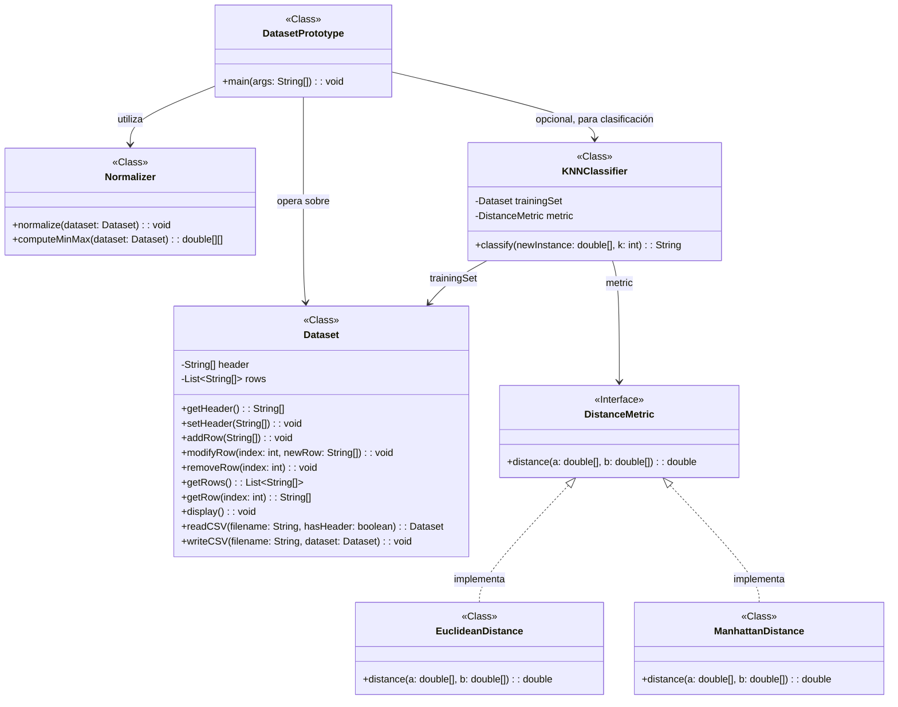

# Sistema de Clasificación k-NN: Dataset y Prototipo

## 📊 Descripción
Este proyecto implementa un prototipo para la gestión de datasets y clasificación de instancias utilizando el algoritmo k-NN (k-Nearest Neighbors). Desarrollado como parte de la asignatura "Modelado de Sistemas Software" del Grado en Ingeniería Informática.

## 📝 Diagrama de Clases UML



## 🚀 Características

- **Gestión de datasets**: Lectura, modificación, guardado y visualización de datasets en formato CSV
- **Normalización**: Transformación de atributos numéricos a un rango de 0 a 1
- **Clasificación k-NN**: Implementación del algoritmo para clasificar nuevas instancias
- **Métricas de distancia**: Soporte para distancia Euclidiana y Manhattan

## 🛠️ Estructura del proyecto

```
src/
├── app/
│   └── DatasetPrototype.java     # Clase principal con el flujo de ejecución
├── model/
│   └── Dataset.java              # Gestión de datos con funcionalidad de I/O
├── utils/
│   └── Normalizer.java           # Normalización de datos numéricos
├── metrics/
│   ├── DistanceMetric.java       # Interfaz para métricas de distancia
│   ├── EuclideanDistance.java    # Implementación de distancia euclidiana
│   └── ManhattanDistance.java    # Implementación de distancia Manhattan
├── classifier/
│   └── KNNClassifier.java        # Implementación del algoritmo k-NN
└── data/
    ├── iris.csv                  # Dataset de prueba (Iris flower dataset)
    └── glass.csv                 # Dataset adicional
```

## 📝 Uso

1. **Ejecución del prototipo**:
   ```
   java app.DatasetPrototype
   ```

2. **Flujo de la aplicación**:
   - Solicita el nombre del archivo CSV a leer
   - Muestra el dataset leído
   - Normaliza y muestra el dataset normalizado
   - Permite modificar datos
   - Permite guardar los cambios en un nuevo archivo
   - Opcionalmente, permite clasificar una nueva instancia

## 📄 Ejemplo de uso

```
Introduce el nombre del fichero CSV a leer: data/iris.csv

Dataset leído:
sepal length,sepal width,petal length,petal width,iris
5.1,3.5,1.4,0.2,Iris-setosa
4.9,3.0,1.4,0.2,Iris-setosa
...

Dataset normalizado:
sepal length,sepal width,petal length,petal width,iris
0.22222222222222213,0.625,0.06779661016949151,0.04166666666666667,Iris-setosa
...

¿Quieres clasificar una nueva instancia? (s/n): s
Introduce los atributos (separados por comas): 5.8,2.7,5.1,1.9
Introduce el valor de k: 3
La clase asignada es: Iris-virginica
```

## 📊 Datasets incluidos

1. **iris.csv**: Colección de 150 instancias de flores Iris con 4 atributos:
   - Longitud del sépalo
   - Ancho del sépalo
   - Longitud del pétalo
   - Ancho del pétalo
   - Clase: Iris-setosa, Iris-versicolor, o Iris-virginica

2. **glass.csv**: Colección de 214 instancias de diferentes tipos de vidrio con 9 atributos.

## 🧪 Desarrollo y extensión

Este proyecto está diseñado para ser extensible y servir como base para un sistema de clasificación más completo. Algunas posibles extensiones:

- Implementación de validación cruzada
- Soporte para más métricas de distancia
- Interfaz gráfica
- Soporte para datos categóricos